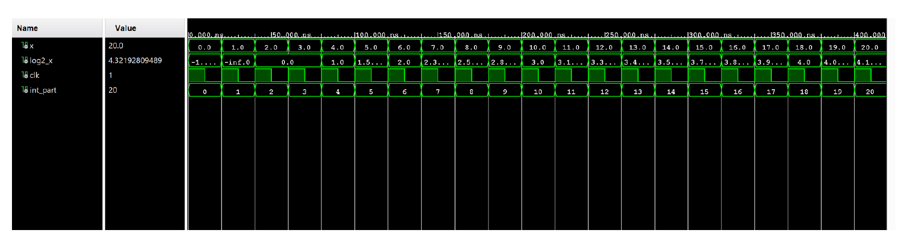
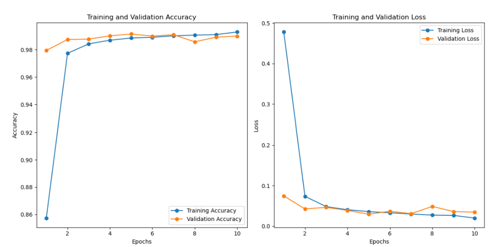
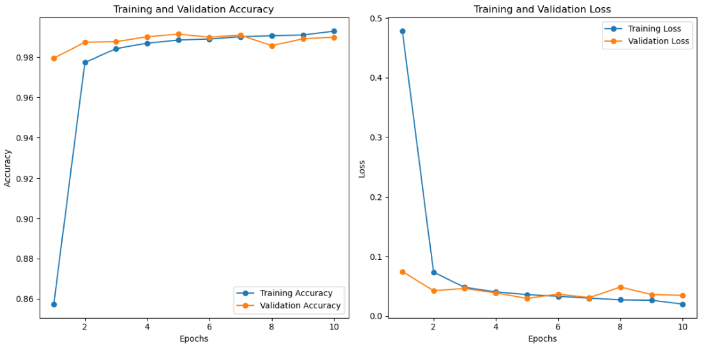
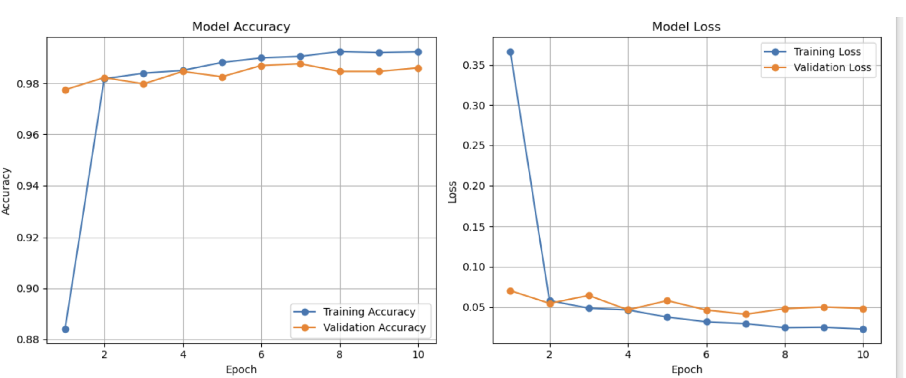
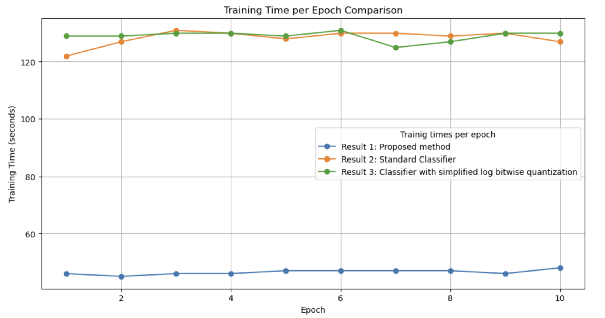

# Log-Quantized CNN for Hardware-Efficient Training

---

## 📌 Project Overview



This project focuses on improving CNN training efficiency using:

- Logarithmic quantization
- Taylor series approximation
- Lookup tables
- Hardware-aware arithmetic simplification

The primary objective is to reduce training time and computational complexity while maintaining comparable classification accuracy. The implementation was evaluated on the MNIST dataset, and a simplified VHDL implementation was also developed to simulate hardware-level behavior.

---

## 🎯 Motivation

Modern Convolutional Neural Networks (CNNs) achieve high accuracy but:

- Require large computational resources
- Have high training times
- Depend heavily on multiply-accumulate (MAC) operations
- Are expensive for hardware deployment

**Inspired by:** Miyashita et al., *"Convolutional Neural Networks Using Logarithmic Data Representation"* (2016)

This project replaces costly multiplication operations with:

- Bit-shift operations
- Additions in the logarithmic domain

---

## 🧠 Core Idea

Instead of operating in the linear domain:

$$y = w \times x$$

We transform into the log domain:

$$\log_2(y) = \log_2(w) + \log_2(x)$$

Multiplication becomes addition, which is:

- Faster
- More hardware-efficient
- Lower precision requirement
- Suitable for FPGA/ASIC implementations

---

## 🔬 Methodology

### 1️⃣ Input Clipping

To ensure numerical stability:

```python
x_clipped = tf.clip_by_value(x, 0.01, 256.0)
```

This avoids negative values, `log(0)` issues, and overflow.

### 2️⃣ Integer and Fractional Separation

```python
int_part = tf.cast(tf.math.floor(x_clipped), tf.int32)
fraction_part = x_clipped - tf.cast(int_part, tf.float32)
```

### 3️⃣ Log2 Lookup Table (Integer Part)

A lookup table stores precomputed values, eliminating runtime log computation:

```python
log2_lookup_np = np.log2(np.arange(1, 257))
log2_lookup = tf.constant(log2_lookup_np, dtype=tf.float32)
```

### 4️⃣ Taylor Series Approximation (Fractional Part)

Instead of computing the full log:

$$\log_2(1 + x) \approx \frac{x}{\ln 2}$$

Implemented as:

```python
log2_fraction_part = fraction_part / log2
```

Only the first Taylor term was used for simplicity.

### 5️⃣ Log Quantization Pipeline

Log quantization is applied on input, after convolution layers, and after dense layers:

```python
x = log_quantize(inputs)
x = self.conv1(x)
x = log_quantize(x)
...
```

This ensures multiplication-heavy operations are minimized throughout training.

---

## 🏗 Model Architecture

- 4 Convolutional layers
- Batch Normalization
- Max Pooling
- Dense layers
- Softmax output

| Metric | Value |
|---|---|
| Total Parameters | ~1.5M |
| Final Training Accuracy | 99.24% |
| Test Accuracy | 98.70% |

---

## 📊 Performance Comparison

| Model | Test Accuracy | Training Time / Epoch |
|---|---|---|
| Standard CNN | ~99.3% | ~125 sec |
| Simplified Bitwise | ~99.3% | ~130 sec |
| **Proposed Log Quantized CNN** | **98.7%** | **~60 sec** |

Training, validation accuracy and loss in simplified Log_Bitwise_MNIST Classifier:


Training, validation accuracy and loss in a Standard_MNIST_classifier:


Training, validation accuracy and loss in the proposed implementation:


Training time per epoch comparison:



> 🔥 **Key Result:** The proposed method reduced training time by nearly **50% per epoch** while maintaining comparable accuracy.


---

## ⚙️ Hardware Implementation (VHDL)

To validate hardware feasibility, a VHDL implementation was created including:

- Integer/Fraction extractor
- Log2 Lookup Table
- Taylor Approximation block
- Top-level log quantizer
- Testbench

**VHDL Modules:**

| File | Description |
|---|---|
| `int_frac.vhd` | Integer/Fraction extractor |
| `log2_lookup.vhd` | Log2 Lookup Table |
| `taylor_approx.vhd` | Taylor Approximation block |
| `log_quantize.vhd` | Top-level log quantizer |
| `tb_log_quantize.vhd` | Testbench |

Simulation verified correct log quantization behavior.

---

## 🛠 Technologies Used

- Python
- TensorFlow / Keras
- NumPy
- VHDL
- ModelSim / Vivado (for simulation)
- MNIST dataset

---

## 📈 Advantages

- ✔ Reduced training time
- ✔ Hardware-efficient arithmetic
- ✔ Lower computational complexity
- ✔ Lookup-based acceleration
- ✔ Scalable to FPGA/ASIC

---

## 🚀 Future Work

- Apply to complex datasets (CIFAR-10, ImageNet)
- Compare different log bases
- Use higher-order Taylor approximations
- Fully populate LUT in VHDL
- Deploy on FPGA
- Evaluate power consumption

---

## 📚 References

1. Miyashita, D., Lee, E. H., & Murmann, B. (2016). *CNN using logarithmic data representation.*
2. Zhao et al. (2018). *Reducing computational complexity of CNNs.*
3. O'Shea (2015). *Introduction to CNNs.*
4. TensorFlow MNIST Dataset.
5. University of Alberta ECE 511 & VHDL Course Material.